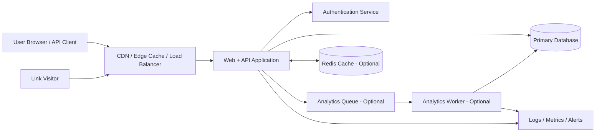
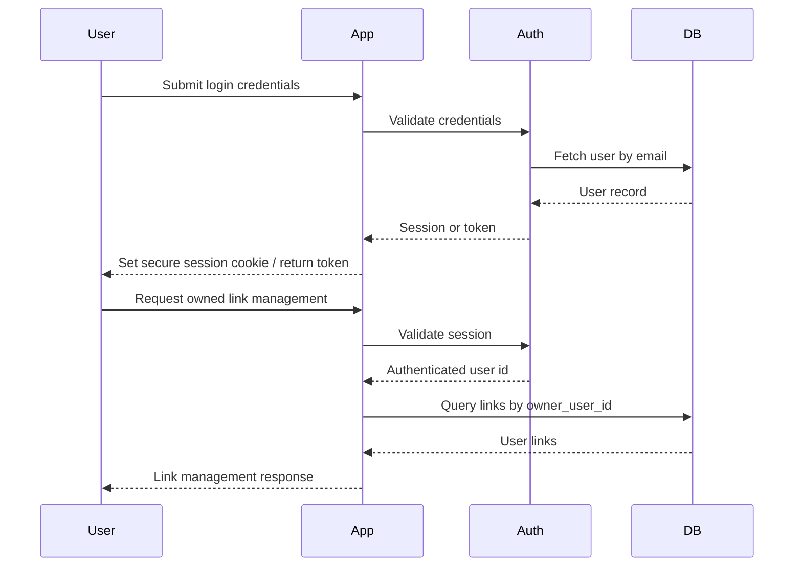
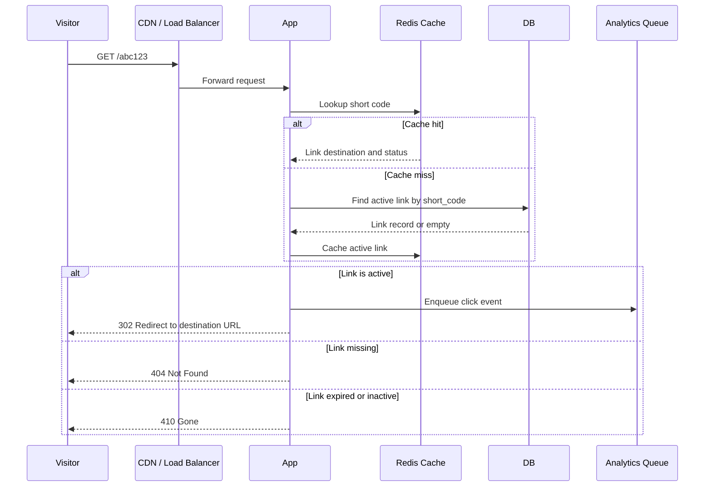
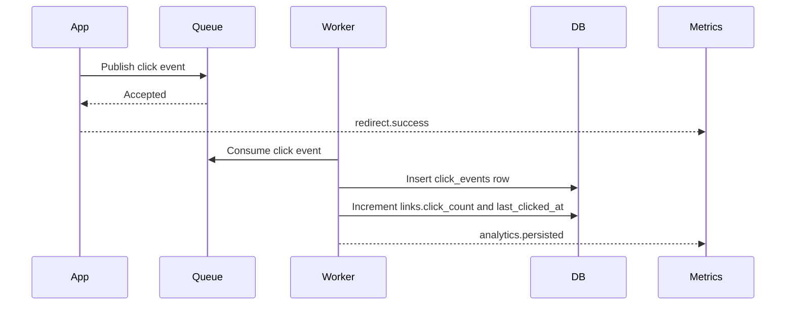

# URL Shortener Architecture

## 1. Overview

This document defines the proposed architecture for the URL Shortener application described in `docs/SRS.md`.

The system provides:

- Short URL creation from valid `http` and `https` destination URLs.
- Optional custom aliases.
- Fast redirection from short codes to destination URLs.
- Basic analytics such as click count and click events.
- Optional authenticated link ownership and management.
- Operational health checks, logging, and abuse controls.

The initial architecture is intentionally simple: a web/API application backed by a relational database. Redis and a background worker are recommended when redirect traffic or analytics volume grows.

## 2. Architecture Diagram



### Component Responsibilities

- **CDN / Load Balancer**: Terminates TLS, routes traffic, applies coarse rate limits, and forwards requests to the application.
- **Web + API Application**: Handles UI pages, REST API requests, URL validation, alias generation, redirects, authorization, and error responses.
- **Authentication Service**: Issues and validates user sessions or tokens when authenticated link ownership is enabled.
- **Primary Database**: Stores users, links, aliases, click counters, and analytics events.
- **Redis Cache**: Optional read-through cache for active short-code lookups and rate-limit counters.
- **Analytics Queue**: Optional queue used to decouple analytics writes from redirect latency.
- **Analytics Worker**: Optional background process that persists click events and aggregates analytics.
- **Logs / Metrics / Alerts**: Captures application health, request counts, redirect failures, validation failures, and unexpected errors.

## 3. Database Schema

The recommended database is PostgreSQL. The schema below supports anonymous links now and authenticated ownership later.

### `users`

Stores authenticated users when accounts are enabled.

| Column | Type | Constraints | Notes |
| --- | --- | --- | --- |
| `id` | UUID | Primary key | Generated by application or database. |
| `email` | VARCHAR(255) | Unique, nullable | Nullable if external auth is used before profile completion. |
| `password_hash` | TEXT | Nullable | Only used for local email/password auth. |
| `display_name` | VARCHAR(120) | Nullable | User-facing name. |
| `role` | VARCHAR(30) | Not null, default `user` | Example values: `user`, `admin`. |
| `created_at` | TIMESTAMPTZ | Not null | Creation timestamp. |
| `updated_at` | TIMESTAMPTZ | Not null | Last update timestamp. |
| `last_login_at` | TIMESTAMPTZ | Nullable | Last successful login. |

Indexes:

- Unique index on `email` where `email IS NOT NULL`.

### `links`

Stores short-code mappings and lifecycle state.

| Column | Type | Constraints | Notes |
| --- | --- | --- | --- |
| `id` | UUID | Primary key | Internal link identifier. |
| `owner_user_id` | UUID | Nullable, FK to `users.id` | Null for anonymous links. |
| `short_code` | VARCHAR(64) | Not null, unique | Generated code or custom alias. |
| `destination_url` | TEXT | Not null | Validated absolute URL. |
| `normalized_destination_url` | TEXT | Not null | Canonicalized form used for comparison and display safety. |
| `management_token_hash` | CHAR(64) | Nullable | Hash of an unguessable token for anonymous link management and analytics access. |
| `title` | VARCHAR(180) | Nullable | Optional user label. |
| `status` | VARCHAR(20) | Not null, default `active` | `active`, `inactive`, `expired`, `deleted`, `blocked`. |
| `is_custom_alias` | BOOLEAN | Not null, default `false` | Distinguishes generated codes from user aliases. |
| `click_count` | BIGINT | Not null, default `0` | Fast aggregate count. |
| `last_clicked_at` | TIMESTAMPTZ | Nullable | Most recent successful redirect. |
| `expires_at` | TIMESTAMPTZ | Nullable | Optional link expiry. |
| `created_at` | TIMESTAMPTZ | Not null | Creation timestamp. |
| `updated_at` | TIMESTAMPTZ | Not null | Last update timestamp. |

Indexes:

- Unique index on `short_code`.
- Index on `owner_user_id`.
- Index on `status`.
- Index on `expires_at`.

### `click_events`

Stores per-click analytics when detailed analytics are enabled.

| Column | Type | Constraints | Notes |
| --- | --- | --- | --- |
| `id` | UUID | Primary key | Event identifier. |
| `link_id` | UUID | Not null, FK to `links.id` | Link that was visited. |
| `clicked_at` | TIMESTAMPTZ | Not null | Event timestamp. |
| `ip_hash` | CHAR(64) | Nullable | Hashed IP, not raw IP. |
| `user_agent` | TEXT | Nullable | Raw user agent, subject to retention policy. |
| `referrer` | TEXT | Nullable | Request `Referer` header value, stored under a correctly spelled application field. |
| `country_code` | CHAR(2) | Nullable | Optional GeoIP-derived country. |
| `device_type` | VARCHAR(30) | Nullable | Optional parsed value. |
| `browser` | VARCHAR(80) | Nullable | Optional parsed value. |
| `os` | VARCHAR(80) | Nullable | Optional parsed value. |

Indexes:

- Index on `link_id, clicked_at DESC`.
- Index on `clicked_at` for retention cleanup.

### `reserved_aliases`

Stores paths that cannot be used as short codes.

| Column | Type | Constraints | Notes |
| --- | --- | --- | --- |
| `alias` | VARCHAR(64) | Primary key | Example: `api`, `admin`, `login`, `docs`, `health`. |
| `reason` | VARCHAR(160) | Nullable | Human-readable reason. |
| `created_at` | TIMESTAMPTZ | Not null | Creation timestamp. |

### `audit_logs`

Stores security-relevant or administrative events.

| Column | Type | Constraints | Notes |
| --- | --- | --- | --- |
| `id` | UUID | Primary key | Event identifier. |
| `actor_user_id` | UUID | Nullable, FK to `users.id` | Null for anonymous/system events. |
| `action` | VARCHAR(80) | Not null | Example: `link.created`, `link.deleted`, `auth.login_failed`. |
| `entity_type` | VARCHAR(80) | Nullable | Example: `link`, `user`. |
| `entity_id` | UUID | Nullable | Target entity. |
| `metadata` | JSONB | Nullable | Redacted contextual data. |
| `created_at` | TIMESTAMPTZ | Not null | Event timestamp. |

Indexes:

- Index on `actor_user_id, created_at DESC`.
- Index on `action, created_at DESC`.

### `otps`

Stores one-time passcodes for authentication-adjacent flows. Raw OTP values are never stored.

| Column | Type | Constraints | Notes |
| --- | --- | --- | --- |
| `id` | ObjectId | Primary key | MongoDB document identifier. |
| `userId` | ObjectId | Nullable, ref `users` | User associated with the OTP when known. |
| `email` | String | Nullable, lowercase | Email delivery or verification target. |
| `phone` | String | Nullable | E.164 phone target for SMS delivery. WhatsApp OTP is temporarily disabled pending Meta WhatsApp Cloud API integration. |
| `purpose` | String | Not null | `LOGIN`, `REGISTER`, `RESET_PASSWORD`, `CHANGE_EMAIL`, `CHANGE_PHONE`. |
| `hashedOtp` | String | Not null, select false | SHA-256 hash using the application hash salt. |
| `expiresAt` | Date | Not null | Defaults to 5 minutes after issue. |
| `attempts` | Number | Not null, max 5 | Failed verification attempts. |
| `used` | Boolean | Not null | Set when verified, exhausted, or superseded. |
| `createdAt` | Date | Not null | Issue timestamp. |

Indexes:

- TTL index on `expiresAt`.
- Compound lookup indexes on `email/purpose/used`, `phone/purpose/used`, and `userId/purpose/used`.

## 4. API Endpoints

All API endpoints return JSON unless otherwise noted.

### Public Link Creation

#### `POST /api/links`

Creates a short link.

Request:

```json
{
  "destinationUrl": "https://example.com/some/long/path",
  "customAlias": "optional-alias",
  "expiresAt": "2026-12-31T23:59:59Z"
}
```

Response `201 Created`:

```json
{
  "id": "uuid",
  "shortCode": "abc123",
  "shortUrl": "https://short.example/abc123",
  "destinationUrl": "https://example.com/some/long/path",
  "createdAt": "2026-07-14T16:00:00Z",
  "expiresAt": "2026-12-31T23:59:59Z"
}
```

Errors:

- `400 Bad Request`: Invalid URL, unsupported protocol, invalid alias format.
- `409 Conflict`: Alias already exists or is reserved.
- `429 Too Many Requests`: Rate limit exceeded.

### Link Details

#### `GET /api/links/{shortCode}`

Returns owner-only or management-token-protected link details. Anonymous links require a link-specific management token; authenticated links require ownership or admin role.

Accepted authentication:

- Authenticated session or bearer token for the owner/admin.
- `X-Link-Management-Token` for anonymous links when that feature is enabled.

Response `200 OK`:

```json
{
  "shortCode": "abc123",
  "shortUrl": "https://short.example/abc123",
  "destinationUrl": "https://example.com/some/long/path",
  "status": "active",
  "clickCount": 42,
  "createdAt": "2026-07-14T16:00:00Z",
  "lastClickedAt": "2026-07-14T17:30:00Z"
}
```

Errors:

- `401 Unauthorized`: Missing or invalid credentials.
- `403 Forbidden`: Authenticated user is not allowed to view this link.
- `404 Not Found`: Short code does not exist.

#### `GET /api/links/{shortCode}/preview`

Returns intentionally public metadata for UI previews without exposing private management data, detailed analytics, or owner identity.

Response `200 OK`:

```json
{
  "shortCode": "abc123",
  "shortUrl": "https://short.example/abc123",
  "status": "active"
}
```

### Authenticated Link Management

These endpoints require an authenticated session or bearer token.

#### `GET /api/me/links`

Lists links owned by the current user.

Query parameters:

- `limit`
- `cursor`
- `status`

#### `PATCH /api/me/links/{shortCode}`

Updates a user-owned link.

Allowed updates:

- `destinationUrl`
- `title`
- `status`
- `expiresAt`

Errors:

- `401 Unauthorized`: Missing or invalid session.
- `403 Forbidden`: Link belongs to another user.
- `404 Not Found`: Link does not exist.

#### `DELETE /api/me/links/{shortCode}`

Soft-deletes or deactivates a user-owned link.

Response:

- `204 No Content`

### Analytics

#### `GET /api/links/{shortCode}/analytics`

Returns basic analytics for a link. For anonymous links, this endpoint should require a management token or be disabled. For authenticated links, it requires ownership or admin role.

Response `200 OK`:

```json
{
  "shortCode": "abc123",
  "clickCount": 42,
  "lastClickedAt": "2026-07-14T17:30:00Z",
  "recentClicks": [
    {
      "clickedAt": "2026-07-14T17:30:00Z",
      "referrer": "https://example.org",
      "countryCode": "US",
      "deviceType": "desktop"
    }
  ]
}
```

### Authentication

#### `POST /api/auth/register`

Creates a user account when local authentication is enabled.

#### `POST /api/auth/login`

Authenticates the user and creates a session.

#### `POST /api/auth/logout`

Invalidates the current session.

#### `GET /api/auth/me`

Returns the current authenticated user.

#### `POST /api/auth/otp/request`

Issues an OTP for a future authentication flow and delivers it with Brevo transactional email or Twilio Verify SMS. Existing unused OTPs for the same user/contact/purpose are marked used before the new code is stored.

TODO: Re-enable WhatsApp OTP when Meta WhatsApp Cloud API integration is implemented. While disabled, `channel: "whatsapp"` returns `WhatsApp OTP is temporarily unavailable.`

Request:

```json
{
  "email": "user@example.com",
  "phone": "+15551234567",
  "purpose": "LOGIN",
  "channel": "email"
}
```

Only one of `email` or `phone` is required. `purpose` must be one of `LOGIN`, `REGISTER`, `RESET_PASSWORD`, `CHANGE_EMAIL`, or `CHANGE_PHONE`; `channel` must be `email` or `sms`. WhatsApp OTP is temporarily disabled pending Meta WhatsApp Cloud API integration.

Response `202 Accepted`:

```json
{
  "otpId": "object-id",
  "expiresAt": "2026-07-24T12:05:00.000Z",
  "channel": "email",
  "delivery": {
    "provider": "brevo",
    "delivered": true
  }
}
```

Errors:

- `400 Bad Request`: Missing or invalid contact, purpose, or channel.
- `429 Too Many Requests`: OTP request cooldown or generation rate limit exceeded.
- `502 Bad Gateway`: Provider delivery failed.

#### `POST /api/auth/otp/verify`

Verifies an OTP without creating a login session. Session creation remains owned by the existing auth flows until OTP login/register UI is introduced.

Request:

```json
{
  "email": "user@example.com",
  "purpose": "LOGIN",
  "otp": "123456"
}
```

Response `200 OK`:

```json
{
  "verified": true,
  "otpId": "object-id",
  "userId": null,
  "email": "user@example.com",
  "phone": null,
  "purpose": "LOGIN"
}
```

Errors:

- `400 Bad Request`: Invalid, expired, reused, or malformed OTP.
- `429 Too Many Requests`: Verification rate limit or 5-attempt cap exceeded.

### Redirect Route

#### `GET /{shortCode}`

Redirects visitors to the destination URL.

Responses:

- `301 Moved Permanently` or `302 Found`: Active short link.
- `404 Not Found`: Unknown short code.
- `410 Gone`: Expired or inactive short link.
- `429 Too Many Requests`: Abuse or traffic limit exceeded.

Use `302 Found` by default during early releases so destination updates take effect immediately. Consider `301 Moved Permanently` only for immutable links.

### Operations

#### `GET /health`

Returns a minimal liveness response. This endpoint should not reveal dependency names, topology, versions, or credentials.

Response:

```json
{
  "status": "ok"
}
```

#### `GET /ready`

Returns readiness for deployment platforms. This should fail when the database is unavailable.

Detailed dependency status belongs behind authenticated internal monitoring, not on public health endpoints.

## 5. Folder Structure

Recommended application structure:

```text
URL-Shortener/
  docs/
    SRS.md
    architecture.md
  src/
    app/
      pages-or-routes/
      middleware/
      components/
    api/
      auth/
      links/
      analytics/
      health/
    domain/
      links/
        link.model.*
        link.service.*
        short-code.generator.*
        url-validator.*
      analytics/
        analytics.service.*
        click-event.model.*
      auth/
        auth.service.*
        user.model.*
    infrastructure/
      database/
        migrations/
        repositories/
        connection.*
      cache/
      queue/
      logging/
      config/
    security/
      rate-limit.*
      input-sanitizer.*
      reserved-aliases.*
      permissions.*
    tests/
      unit/
      integration/
      e2e/
  .env.example
  README.md
```

The exact framework can adjust this layout, but the separation should remain:

- `domain`: Business rules and validation.
- `api`: Request and response handling.
- `infrastructure`: Database, cache, queues, logging, and configuration.
- `security`: Cross-cutting controls.
- `tests`: Unit, integration, and redirect-flow coverage.

## 6. Authentication Flow

Authentication is optional for the MVP but the architecture supports it.



Authentication rules:

- Anonymous users may create links only if product policy allows it.
- Authenticated users own links through `links.owner_user_id`.
- Link update, delete, and detailed analytics require ownership or admin role.
- Session cookies must be `HttpOnly`, `Secure`, and `SameSite=Lax` or stricter.
- Passwords, if local auth is used, must be hashed with a strong adaptive algorithm such as Argon2id or bcrypt.
- Failed login attempts should be rate-limited and logged.

## 7. Redirect Flow



Redirect rules:

- Extract `shortCode` from the root path.
- Reject reserved paths before short-code lookup.
- Lookup active links by exact `short_code`.
- Treat `expires_at <= now()` as expired.
- Record analytics asynchronously when a queue is available.
- If no queue exists, increment `click_count` in the database quickly and avoid expensive analytics processing in the request path.
- Return redirects without exposing internal link IDs or database details.

## 8. Analytics Flow



Analytics behavior:

- `click_count` is the primary metric for the MVP.
- Detailed events are stored in `click_events` when retention and privacy rules are defined.
- Raw IP addresses should not be stored. Store a salted hash only when unique visitor estimation is required.
- Redirect success must not depend on detailed analytics persistence.
- If the queue is down, the application may fall back to a direct counter increment or skip detailed event logging while emitting an operational alert.
- Analytics retention should be configurable to avoid unbounded growth.

## 9. Security Architecture

### Input Validation

- Allow destination URLs only with `http` and `https` protocols.
- Reject malformed URLs, empty values, unsupported schemes, credentials in URLs, and control characters.
- Reject localhost, loopback, private network ranges, link-local ranges, multicast ranges, and cloud metadata service addresses.
- Resolve hostnames during safety checks and reject DNS results that point to blocked address ranges. Re-check periodically or at redirect time for mutable destinations to reduce DNS rebinding risk.
- Normalize URLs before storage.
- Validate custom aliases with a strict allowlist, such as `^[A-Za-z0-9_-]{3,64}$`.
- Reject aliases that collide with application routes or `reserved_aliases`.

### Abuse Prevention

- Rate-limit URL creation by IP address and authenticated user id.
- Rate-limit login attempts by IP address and account identifier.
- Add stricter limits for custom alias creation.
- Monitor high-volume redirects and suspicious creation patterns.
- Support administrative blocking by setting `links.status = 'blocked'`.

### Authorization

- Public redirect access does not require authentication.
- Link management requires ownership or admin role.
- Detailed analytics require ownership, admin role, or a secure management token for anonymous links.
- Anonymous link management should use an unguessable management token if offered; store only `management_token_hash` and show the raw token once.

### Data Protection

- Store secrets only in environment variables or managed secret storage.
- Never log passwords, session tokens, authorization headers, raw database errors, or full sensitive URLs when policy disallows it.
- Hash passwords with Argon2id or bcrypt.
- Hash API keys and management tokens before storage.
- Store only hashed IP addresses for analytics if unique visitor tracking is required.
- Apply retention rules to click events and audit logs.

### Transport and Browser Security

- Enforce HTTPS in production.
- Use HSTS after HTTPS is stable.
- Set secure cookie attributes: `HttpOnly`, `Secure`, and `SameSite`.
- Use CSRF protection for cookie-authenticated state-changing requests.
- Return consistent error messages without stack traces.

### Redirect Safety

- Do not allow `javascript:`, `data:`, `file:`, or other unsafe schemes.
- Consider optional domain blocklists for known abusive destinations.
- Prevent short-code enumeration from exposing private metadata.
- Do not follow destination URLs server-side during redirect.
- Use `rel="noopener noreferrer"` for any UI-rendered outbound links.

### Database Security

- Use least-privilege database credentials.
- Enforce unique constraints in the database, not only in application code.
- Use parameterized queries or ORM-safe query builders.
- Run migrations through controlled deployment steps.
- Back up the database and test restore procedures.

### Observability and Incident Response

- Log URL creation, validation failures, redirect misses, expired link access, auth failures, and admin actions.
- Track metrics for request count, redirect latency, error rate, database latency, cache hit rate, and queue depth.
- Alert on sustained redirect failures, database errors, queue backlog, and abnormal creation spikes.

## 10. Key Design Decisions

- **Relational database first**: PostgreSQL provides strong uniqueness guarantees for short codes and simple reporting for analytics.
- **Asynchronous analytics preferred**: Redirects should remain fast even when analytics writes are slow.
- **Generated codes are immutable by default**: Updating the destination can be allowed, but changing a short code should create a new link to avoid broken shares.
- **Soft delete over hard delete**: Preserve auditability and prevent immediate alias reuse surprises.
- **Authentication-ready schema**: Anonymous MVP links are supported without blocking future user-owned link management.

## 11. Non-Functional Targets

- Redirect route p95 latency: under 100 ms from application receipt under normal load.
- Link creation p95 latency: under 500 ms under normal load.
- Availability target: 99.9% for redirect traffic after production launch.
- Short-code collision handling: retry generation and rely on database unique constraint.
- Analytics durability: best effort for MVP, durable queued processing for production scale.
