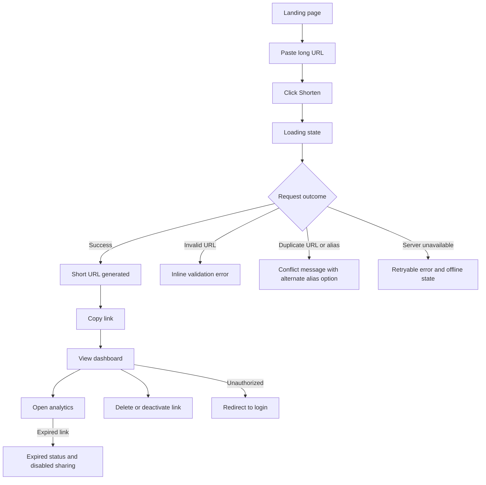

# Phase 3 UI/UX Plan

## User Flow



Edge cases:

- Invalid URL: reject unsupported schemes, malformed URLs, private network destinations, and empty input with field-level guidance.
- Server unavailable: keep entered data, show a retry action, and expose an offline banner when connectivity drops.
- Duplicate URL or alias: show the existing short link when policy allows; otherwise suggest editing the alias.
- Expired links: mark as expired, disable copy/share actions, and show a renewal path for owners.
- Unauthorized dashboard access: redirect to login and preserve the original route for post-login navigation.

## Wireframes

### Landing

```text
Mobile                  Tablet/Desktop
+----------------+      +------------------------------------------------+
| Header [menu]  |      | Logo  Features Pricing FAQ              Login  |
| URL input      |      | Hero headline + URL form + live preview        |
| Shorten button |      | Feature band | How it works | FAQ | CTA       |
| Result card    |      | Footer                                          |
+----------------+      +------------------------------------------------+
```

### Dashboard

```text
Mobile                  Tablet/Desktop
+----------------+      +------------------------------------------------+
| Top bar        |      | Sidebar | Top bar/search/filter/create          |
| Stats stack    |      | Sidebar | Stat cards row                         |
| Search/filter  |      | Sidebar | Links table with pagination            |
| Link cards     |      | Sidebar | Empty/loading/error states             |
+----------------+      +------------------------------------------------+
```

### Analytics

```text
Mobile                  Tablet/Desktop
+----------------+      +------------------------------------------------+
| Header         |      | Sidebar | Link summary + date range              |
| Click chart    |      | Sidebar | Click chart + countries/devices grid   |
| Metric cards   |      | Sidebar | Browsers/referrers/timeline panels     |
+----------------+      +------------------------------------------------+
```

### Authentication

```text
Mobile/Desktop
+----------------------------------+
| Logo                             |
| Auth card                        |
| Inputs, validation, primary CTA  |
| Secondary links                  |
+----------------------------------+
```

### Settings

```text
Mobile                  Tablet/Desktop
+----------------+      +------------------------------------------------+
| Tabs           |      | Sidebar | Settings tabs                          |
| Profile form   |      | Sidebar | Profile/password/theme/API/danger      |
+----------------+      +------------------------------------------------+
```

### 404

```text
+----------------------------------+
| Illustration                     |
| Friendly message                 |
| Back home button                 |
+----------------------------------+
```

## Design System

### Color Palette

| Role | Light HEX | Dark HEX | Tailwind token |
| --- | --- | --- | --- |
| Background | `#f8fafc` | `#020617` | `bg-background` |
| Foreground | `#0f172a` | `#f8fafc` | `text-foreground` |
| Card | `#ffffff` | `#0f172a` | `bg-card` |
| Primary | `#2563eb` | `#60a5fa` | `bg-primary` |
| Secondary | `#4f46e5` | `#818cf8` | `text-secondary` |
| Accent | `#059669` | `#34d399` | `text-accent` |
| Success | `#16a34a` | `#4ade80` | `text-success` |
| Warning | `#d97706` | `#fbbf24` | `text-warning` |
| Error | `#dc2626` | `#f87171` | `text-destructive` |
| Border | `#dbe3ef` | `#1e293b` | `border-border` |
| Muted | `#64748b` | `#94a3b8` | `text-muted-foreground` |

### Typography

- Headings: Inter, 700 weight, `text-3xl` to `text-6xl`, line height 1.05-1.2.
- Body: Inter, 400-500 weight, `text-sm` to `text-base`, line height 1.5-1.7.
- Labels and navigation: Inter, 500-600 weight, `text-xs` to `text-sm`.
- Monospace: JetBrains Mono for short codes, API keys, timestamps, and URL fragments.
- Responsive scaling uses Tailwind breakpoints, not viewport-width font formulas.

### Spacing

Use an 8px-centered scale: `1` 4px, `2` 8px, `3` 12px, `4` 16px, `6` 24px, `8` 32px, `12` 48px, `16` 64px.

### Radius

- Cards: 8px.
- Buttons and inputs: 8px.
- Modals: 8px.
- Badges: 999px for pills, 6px for compact labels.

### Shadows

- Small: subtle border plus `0 1px 2px rgb(15 23 42 / 0.06)`.
- Medium: `0 12px 30px rgb(15 23 42 / 0.08)`.
- Large: `0 24px 60px rgb(15 23 42 / 0.12)`.
- Extra large: reserved for modals and sheets only.

### Icon System

Use Lucide React at 16px or 20px. Copy uses `Copy`, delete uses `Trash2`, analytics uses `BarChart3`, settings uses `Settings`, user uses `User`, logout uses `LogOut`, loading uses `Loader2`, error uses `CircleAlert`, success uses `CircleCheck`.

## Component Inventory

Reusable components are grouped under:

- `components/ui`: Button, Input, Label, Card, Badge, Dialog, Alert, Skeleton, Tabs, Switch, Tooltip, Table.
- `components/layout`: AppShell, Navbar, Sidebar, Footer, MobileNav.
- `components/forms`: AuthForm, CreateLinkForm, SettingsForms, SearchFilters.
- `components/charts`: ClicksChart, MetricList, AnalyticsCard.
- `components/common`: CopyButton, EmptyState, LoadingState, StatCard, ThemeToggle, Pagination.

## Responsive Strategy

- Mobile 320-639px: single-column layout, hamburger navigation, card-based tables, full-width modals.
- Small tablet 640-767px: two-column stat grids, compact filters, drawer navigation.
- Tablet 768-1023px: collapsible sidebar, responsive table overflow only inside the table region.
- Laptop 1024-1279px: persistent sidebar and dashboard table layout.
- Desktop 1280-1535px: wider analytics grids and persistent filters.
- Large desktop 1536px+: constrained content width to preserve scanability.

All interactive controls use at least 44px touch targets, visible focus rings, semantic HTML, ARIA labels where icons stand alone, and high-contrast light/dark tokens.
